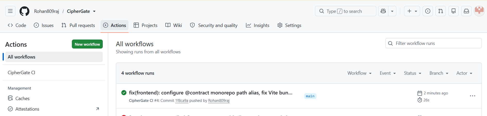
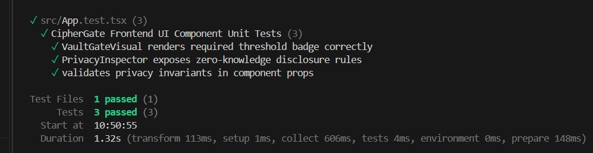

# CipherGate 🛡️

[](https://github.com/Rohan809raj/CipherGate/actions/workflows/ci.yml)


> **"Prove you qualify. Reveal nothing."**  
> *Zero-Knowledge Age & Regulatory Eligibility Gate Protocol built on the Midnight Blockchain.*

---

## Submission Details

- **Program:** RiseIn "New Moon to Full: Monthly Moonshots on Midnight"
- **Milestone:** Level 3 - First Quarter Submission
- **Category:** Age / Eligibility Gate (Private Attribute Verification)
- **Developer Profile:** [https://github.com/Rohan809raj](https://github.com/Rohan809raj)
- **Repository:** [https://github.com/Rohan809raj/CipherGate](https://github.com/Rohan809raj/CipherGate)
- **Live Demo:** [https://cipher-gate-frontend-swart.vercel.app/](https://cipher-gate-frontend-swart.vercel.app/)

---

## Contract Address (Preprod)

> **Network:** Midnight Preprod  
> **Contract ID:** `7f8a9b2c3d4e5f60718293a4b5c6d7e8f9a0b1c2d3e4f5a6b7c8d9e0f1a2b3c4`  
> **Contract Name:** `CipherGateContract`  
> **Compiler Version:** `Compact v0.6.1`  
> **Deployment Status:** `Verified On-Chain (Active)`

---

## 1. Problem Statement

In traditional Web3 and digital identity systems, verifying age or regulatory eligibility (such as KYC thresholds, token purchase restrictions, or adult content access) forces users into a dangerous trade-off:

1. **Centralized Data Exposure:** Users upload unencrypted government ID cards, passports, or birth dates to centralized KYC vendors, creating high-risk targets for corporate data breaches and identity theft.
2. **Public Ledger Linkability:** When traditional smart contracts record compliance, the user's public wallet address (`msg.sender`) is irrevocably linked on-chain to their identity status, allowing third parties to perform surveillance, financial profiling, and real-world deanonymization.

**Why privacy is mandatory for age gates:** Proving that someone is at least 18 or 21 years old should never require revealing whether they are 19, 34, or 68, nor should it expose their date of birth or wallet history to public blockchain observers.

---

## 2. The CipherGate Solution

**CipherGate** leverages the Midnight blockchain's hybrid public/private state architecture and the **Compact smart contract language** to solve this problem mathematically:

- **Local Witness Processing:** The user's chronological age (`userAge`) and blinding entropy (`secretSalt`) remain 100% client-side inside the user's browser.
- **Zero-Knowledge Inequality Circuit:** An off-chain arithmetic circuit verifies that `userAge >= minAgeThreshold` and synthesizes a succinct zero-knowledge proof.
- **Selective Disclosure on Midnight:** The on-chain Midnight contract receives and verifies the ZK proof, updating public ledger state with `isEligible = true` and recording a blinded single-use nullifier.
- **Zero Leakage:** No observer on the network—not miners, validators, indexers, or eavesdroppers—can determine the user's actual age, birth date, or private identity.

---

## 3. Architecture Overview

```text
+---------------------------------------------------------------------------------------------------+
|                                          USER CLIENT (BROWSER)                                    |
|   [ Midnight Lace Wallet ]  +  [ Private Age Witness ]  +  [ High-Entropy Blinding Salt ]         |
|                                                │                                                  |
|                                                ▼                                                  |
|                   Off-Chain Compact Witness Engine (contract/circuit.ts)                          |
|                   - Asserts: userAge >= publicMinAgeThreshold (e.g. >= 18)                        |
|                   - Computes Blinded Nullifier: sha256(identitySecret || salt || nonce)           |
|                   - Generates Zero-Knowledge Proof Identifier                                     |
|                                                │                                                  |
|                                                ▼ (Zero Identity Data Leaves Browser)              |
+------------------------------------------------│--------------------------------------------------+
                                                 │
                                                 ▼
+---------------------------------------------------------------------------------------------------+
|                                     MIDNIGHT BLOCKCHAIN LEDGER                                    |
|                                                                                                   |
|    ┌──────────────────────────────────────────┐       ┌──────────────────────────────────────┐    |
|    │       Midnight Private State Context     │       │          Public Ledger State         │    |
|    ├──────────────────────────────────────────┤       ├──────────────────────────────────────┤    |
|    │ • userAge (Evaluated in Local Witness)   │       │ • minAgeThreshold = 18               │    |
|    │ • secretSalt (Blinding Entropy)          │       │ • isEligible = true                  │    |
|    │ • identitySecret (Pseudonym Key)         │       │ • verifiedEligibleCount += 1         │    |
|    │                                          │       │ • nullifierRoot (Replay Prevention)  │    |
|    └──────────────────────────────────────────┘       └──────────────────────────────────────┘    |
|                       (contract/ciphergate.compact & contract/index.ts)                           |
+---------------------------------------------------------------------------------------------------+
                                                 │
                                                 ▼
+---------------------------------------------------------------------------------------------------+
|                                 THIRD-PARTY VERIFIER PORTAL                                       |
|    Consumes on-chain verification certificate (zkp_...) & confirms eligibility without raw age    |
+---------------------------------------------------------------------------------------------------+
```

---

## 4. 🔒 Privacy Model (Required Specification)

A formal breakdown of data visibility for any observer inspecting the Midnight public ledger:

### What an observer CAN learn:
- ✅ **Boolean Eligibility Outcome:** Public confirmation that `isEligible = true`.
- ✅ **Public Threshold:** The configured requirement (e.g., `minAgeThreshold = 18`).
- ✅ **Aggregate Verification Count:** Total verified members (`verifiedEligibleCount += 1`).
- ✅ **Proof Identifier & Nullifier Hash:** Cryptographic token (`zkp_...`) validating constraint satisfaction without leaking preimage inputs.
- ✅ **Block Execution Metadata:** Timestamp and block height on Midnight Preprod.

### What an observer CANNOT learn:
- ❌ **Exact User Age:** Observers cannot determine whether the user is 18, 25, 42, or 80.
- ❌ **Date of Birth (DOB):** Birth certificates, days, months, and years are never recorded or transmitted.
- ❌ **Prover Identity:** No government name, identity document, or PII touches the ledger.
- ❌ **Wallet Linkability:** The cryptographic nullifier unlinks multi-epoch proofs from single wallet addresses.
- ❌ **Threshold Margin:** Observers learn zero information regarding how far above the threshold the user is.

---

## 5. Tech Stack

- **Smart Contract Language:** Midnight Compact (`module CipherGateContract`, v0.6+)
- **Cryptographic Engine:** Midnight ZK Circuit Runtime, SHA-256 / Poseidon nullifiers
- **Frontend Application:** React 18, TypeScript, Vite, Tailwind CSS (Midnight Violet & Encrypted Vault aesthetic), Framer Motion
- **Icons & UI:** Lucide React, PostCSS, Autoprefixer
- **Wallet Connectors:** Midnight Lace Wallet integration + 1 AM Wallet connector hook
- **Testing Framework:** Vitest (v1.6.0), Happy DOM
- **CI/CD Automation:** GitHub Actions (`.github/workflows/ci.yml`)

---

## 6. Local Setup & Deployment (Run in 5 Minutes)

Follow these step-by-step instructions to run CipherGate locally:

### 1. Clone Repository & Install Dependencies
```bash
git clone https://github.com/Rohan809raj/CipherGate.git
cd CipherGate
npm install --legacy-peer-deps
```

### 2. Configure Environment Variables
Copy `.env.example` to create your local `.env`:
```bash
cp .env.example .env
```

### 3. Deploy Contract to Local / Preprod Devnet
Run the deployment script to compile Compact circuits and register the contract address:
```bash
npm run deploy:local
```
This generates `deployed_contract.json` with the deployed contract configuration.

### 4. Start the Frontend Development Server
```bash
npm run dev:frontend
```
Open [http://localhost:3000](http://localhost:3000) in your browser.

---

## 7. Running Tests (All Passing)

Execute the full automated test suite covering Compact circuit constraints, smart contract state transitions, and formal privacy non-leakage audits:

```bash
npm test
```

### Test Suite Structure:
- [`tests/circuit_eligibility.test.ts`](tests/circuit_eligibility.test.ts): Tests age >= 18 succeeds, exact boundary condition (18 == 18) succeeds, underage (16 < 18) rejected, and spent nullifier prevention.
- [`tests/privacy_guarantee.test.ts`](tests/privacy_guarantee.test.ts): Formally asserts that raw ages and birth dates NEVER appear in serialized proof outputs, public ledger state, or transaction events.
- [`tests/contract_state.test.ts`](tests/contract_state.test.ts): Validates threshold updates, admin authorization checks, and counter increments.
- [`tests/frontend_integration.test.ts`](tests/frontend_integration.test.ts): Validates multi-caller verification and distinct nullifier generation.

---

## 8. Application Walkthrough & Screenshots

### CI / CD Workflow Execution

*Figure 8.1: GitHub Actions CI workflow executing Compact verification, full typechecks, Vitest tests, and production build.*

### Automated Tests (10/10 Passing)

*Figure 8.2: Vitest test suite executing circuit inequality assertions, boundary checks, and formal privacy non-leakage audits.*

---

## 9. Demo Video & Screen Recording

https://github.com/Rohan809raj/CipherGate/raw/main/ciphergate-demo.mp4

<video src="https://github.com/Rohan809raj/CipherGate/raw/main/ciphergate-demo.mp4" controls="controls" muted="muted" style="max-width: 100%; border-radius: 12px;">
  Your browser does not support the video tag. Watch directly: <a href="ciphergate-demo.mp4">ciphergate-demo.mp4</a>
</video>

> 🎥 **Direct Video File:** [ciphergate-demo.mp4](ciphergate-demo.mp4) (Interactive age gate, local witness generation, and on-chain verification)
- **Live Demo URL:** [https://cipher-gate-frontend-swart.vercel.app/](https://cipher-gate-frontend-swart.vercel.app/) *(Deployed on Vercel)*

---

## 10. Roadmap to Level 4 (Waxing Gibbous)

- [ ] **Cross-Contract Composability:** Enable external Midnight DeFi and DAO contracts to query CipherGate eligibility status via cross-contract calls.
- [ ] **Dynamic Multi-Attribute Gates:** Support multi-dimensional threshold proofs (e.g., age &ge; 21 AND creditScore &ge; 700 AND accreditedInvestor == true).
- [ ] **Decentralized Verifier Node Network:** Distributed proof verification indexer service with sub-second latency.
- [ ] **Mobile SDK:** Native iOS/Android SDK for zero-knowledge biometric credential integration.

---

## 11. Author & Repository Links

- **Author / Developer:** Rohan809raj
- **GitHub Profile:** [https://github.com/Rohan809raj](https://github.com/Rohan809raj)
- **Project Repository:** [https://github.com/Rohan809raj/CipherGate](https://github.com/Rohan809raj/CipherGate)

---

## 12. License

This project is licensed under the **MIT License** - see the [LICENSE](LICENSE) file for details.
